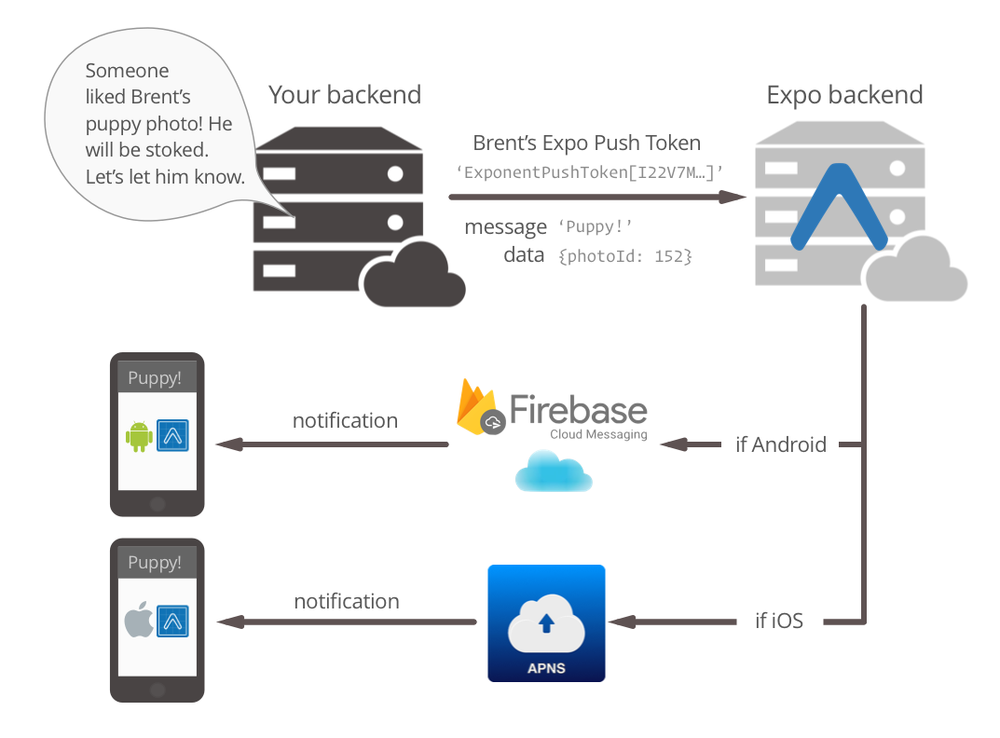

<h1>Projeto Generico Expo</h1>

Projeto padrão para inicio de desenvolvimento

usando Expo com ambiente de configurado.

<h2>Navegação</h2>

Projeto já configurado com Expo Router V3, também com drawer já instalado, <a href='https://docs.expo.dev/router/advanced/drawer/' target='_blank'>Clique Aqui.</a>.

Deve ir atualizando conforme necessidade do dev.

<h2>React Hook Forms</h2>

Já instalado, lembre de usar a parte especifica para react native

na documentação do react rook forms: <a href='https://react-hook-form.com/get-started#ReactNative' target='_blank'>Clique aqui</a>

<h2>Immer</h2>

Immer instalado, uma lib muito show para manipulação de estados.<a href='https://immerjs.github.io/immer/' target='_blank'>Clique aqui</a>

<h2>Native Base</h2>

Acesse o caminho abaixo:

node_modules\native-base\src\core\NativeBaseProvider.tsx

Deletar o provider do SSR, linha 97 pois não é mais usada nas novas versões do react.

<h2>MMKV</h2>

hoje é o pacote de armazenamento interno mais rapido para react.

<a href='https://github.com/mrousavy/react-native-mmkv' target='_blank'>Documentação aqui</a>

<h1>Configurando Push Notifications</h1>
<ol>
    <li>As notificações do Expo, trabalham com o expo intermediando as rquisições, essas por sua vez, são transmitidas via Firebase (android) ou APNS(apple):
      
    </li>
    <ol>
        <li>Por conta disso, vamos instalar as seguintes dependencias:
          <ol>
            <li>
              <code>
                npx expo install expo-notifications expo-device expo-constants
              </code>
            </li>
            <li>
              <code>
                npx expo install @react-native-firebase/app
              </code>
            </li>
          </ol>
        </li>
    </ol>
  <li>
    Com as dependencias instaladas, vá até seu app.json e adicione "@react-native-firebase/app" no array de plugins:
    <code>
      "plugins": [
      "@react-native-firebase/app"
      ]
    </code>
  </li>
  <li>
    Com as dependencias instaladas, vá até seu app.json e adicione "@react-native-firebase/app" no array de plugins:
    <code>
      "plugins": [
      "@react-native-firebase/app"
      ]
    </code>
  </li>
</ol>

<h2>Gerando Build sem Expo.</h2>
<ol>
    <li>Entre na pasta do aplicativo
      <ol>
        <li>Rode os comandos abaixo para gerar os arquivo de keystore (chave). Uma linha de comando de cada vez</li>
        <li>
          keytool -genkeypair -v -keystore my-upload-key.keystore -alias my-key-alias -keyalg RSA -keysize 2048
          -validity 10000
          <ol>
            <li>algumas perguntas serão feitas, lembre de colocar uma senha segura.</li>
          </ol>
        </li>
        <li>
          keytool -genkey -v -keystore my-release-key.keystore -alias my-key-alias -keyalg RSA -keysize 2048 -validity
          10000
          <ol>
            <li>algumas perguntas serão feitas, lembre de colocar uma senha segura.</li>
          </ol>
        </li>
        <li>Ao finalizar serão gerados os arquivos das chaves na pasta ao app (my-release-key.keystore e
          my-upload-key.keystore).</li>
      </ol>
    </li>
    <li>Copie as chaves e cole na pasta app que fica dentro da pasta android do seu projeto ({seuApp}\android\app)</li>
    <li>Agora vamos configurar as váriaveis do Gradle
      <ol>
        <li>Na pasta android do seu projeto ( {seuApp}\android ) no arquivo gradle.properties insira os comandos a
          seguir:
          <ol>
            <li>
MYAPP_UPLOAD_STORE_FILE=my-upload-key.keystore

            
MYAPP_UPLOAD_KEY_ALIAS=my-key-alias

            
MYAPP_UPLOAD_STORE_PASSWORD=***Senha que vc digitou antes***

            
MYAPP_UPLOAD_KEY_PASSWORD=***Senha que vc digitou antes***

            </li>
          </ol>
        </li>
      </ol>
    </li>
    <li>Na pasta ( {seuApp}\android\app ) no arquivo build.gradle insira os comandos dentro de android {signingConfigs}
      <ol>
        <li>
          
release {

          
 if (project.hasProperty('MYAPP_UPLOAD_STORE_FILE')) {

          
 storeFile file(MYAPP_UPLOAD_STORE_FILE)

          
storePassword MYAPP_UPLOAD_STORE_PASSWORD

          
keyAlias MYAPP_UPLOAD_KEY_ALIAS

          
keyPassword MYAPP_UPLOAD_KEY_PASSWORD

          
}

          
}

        </li>
        <li>
          
(e dentro do buildTypes) insira o comando:

          
release {

          
signingConfig signingConfigs.release

          
}

        </li>
      </ol>
    </li>
    <li>Gerando o arquivo APK
      <ol>
        <li>
          
No prompt digite o comando dentro da pasta ( Android ) do seu App digite:

          
.\gradlew assembleRelease

        </li>
        <li>
          
Para gerar o AAB para publicar na google play digite o comando:

          
.\gradlew bundleRelease

        </li>
      </ol>
    </li>
    <li>O APK se encontrará na pasta
      <ol>
        <li>
          
...\android\app\build\outputs\apk\release

        </li>
        <li>
          
O AAB se encontrará na pasta

          
...\android\app\build\outputs\bundle\release

        </li>
      </ol>
    </li>
  <ol>